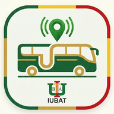

<div align="center">
  

  # 🚌 IUBAT Bus Tracker

  **A community-driven real-time GPS tracking application for IUBAT university buses.**

  <p align="center">
    <a href="#features">Features</a> •
    <a href="#tech-stack">Tech Stack</a> •
    <a href="#installation">Installation</a> •
    <a href="#architecture">Architecture</a> •
    <a href="#contributing">Contributing</a>
  </p>
</div>

---

## 🌟 Overview

The **IUBAT Bus Tracker** is a React Native mobile application built to eliminate the uncertainty of waiting for university transport. Designed specifically for the students of the International University of Business Agriculture and Technology (IUBAT), this app provides a live map displaying the exact locations of active university buses.

What makes this project unique is its **community-driven** approach. Instead of relying on expensive hardware trackers installed on the buses, any student riding the bus can securely broadcast their location in the background, serving as a beacon for hundreds of other students waiting down the route.

## ✨ Features

- **Live GPS Tracking:** Watch buses move in real-time on a smooth, interactive Leaflet map.
- **Background Broadcasting:** A dedicated "Seeder" mode allows volunteers to broadcast their GPS coordinates securely in the background, minimizing battery drain.
- **Smart Route Filtering:** Search and select your specific route. The map automatically isolates and displays only the buses relevant to your journey.
- **Dynamic ETA Engine:** Tap an active bus to generate a live driving path and an Estimated Time of Arrival (ETA). The engine intelligently understands whether the bus is heading *to* campus (morning) or *from* campus (afternoon).
- **Anti-Spam & Moderation:** A built-in reporting system allows users to flag fake broadcasts. Buses with 3 or more reports are automatically banished from the map.
- **Self-Cleaning Database:** Firebase synchronization automatically filters out stale data (buses inactive for > 2 hours).
- **Modern UI:** Built with NativeWind (Tailwind CSS), featuring seamless animations and comprehensive Light/Dark mode support.

## 🛠 Tech Stack

- **Framework:** [React Native](https://reactnative.dev/) (CLI)
- **Styling:** [NativeWind](https://www.nativewind.dev/) (Tailwind CSS for React Native)
- **Database:** [Firebase Realtime Database](https://firebase.google.com/docs/database)
- **Mapping:** [Leaflet](https://leafletjs.com/) rendered via `react-native-webview`
- **Background Tasks:** `react-native-background-actions`
- **Geolocation:** `@react-native-community/geolocation`
- **Notifications:** `@notifee/react-native`

## 🚀 Installation & Local Development

### Prerequisites
- Node.js (v22.11.0 or newer)
- Android Studio & Android SDK
- Java Development Kit (JDK 17)

### 1. Clone the repository
```bash
git clone https://github.com/ashrafsdrop/IUBAT-Bus-Tracker.git
cd IUBAT-Bus-Tracker
```

### 2. Install dependencies
```bash
npm install
```

### 3. Firebase Configuration
You will need to set up a Firebase Realtime Database.
1. Create a Firebase Project.
2. Enable Realtime Database.
3. Update `src/firebaseConfig.ts` with your project's credentials.

### 4. Run the application
```bash
# Start the Metro bundler
npm start

# In a new terminal, run the app on an Android emulator or physical device
npm run android
```

## 📦 Building for Production

To generate a signed, production-ready APK with ProGuard obfuscation enabled:

```bash
cd android
./gradlew assembleRelease
```
The compiled APK will be available at `android/app/build/outputs/apk/release/app-release.apk`.

## 🏗 Architecture & Core Concepts

- **Bi-Directional Mapping:** The map is rendered using a highly optimized injected Leaflet instance inside a WebView. React Native and the WebView communicate bi-directionally using `postMessage` and `injectJavaScript`.
- **Stateless Client Routing:** The React Native client calculates route ETAs dynamically using the OSRM (Open Source Routing Machine) network via Leaflet Routing Machine.
- **Jitter Algorithm:** To prevent multiple buses on the same route from perfectly overlapping and hiding each other on the map, a deterministic radial jitter is applied based on the bus identifier.

## 🤝 Contributing

This is an open-source initiative for the IUBAT community. Contributions, issues, and feature requests are highly welcome!

1. Fork the Project
2. Create your Feature Branch (`git checkout -b feature/AmazingFeature`)
3. Commit your Changes (`git commit -m 'Add some AmazingFeature'`)
4. Push to the Branch (`git push origin feature/AmazingFeature`)
5. Open a Pull Request

## 📄 License

This project is open-source and distributed under the [MIT License](LICENSE).

---
*Created with ❤️ for the IUBAT Community.*
